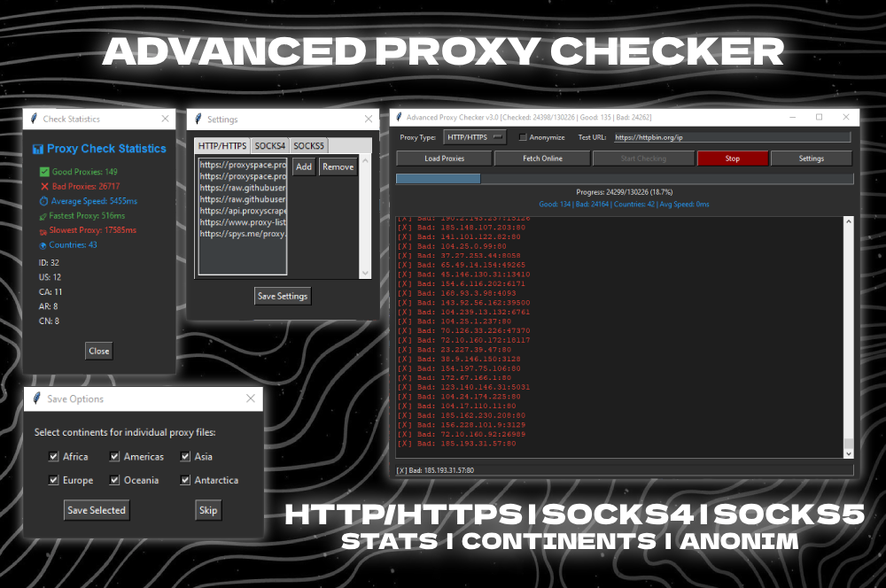

# 🔥 Advanced Proxy Checker

────────────────────────────

# 💻 Installation:
```
git clone https://github.com/yourusername/proxy-checker.git
cd proxy-checker
pip install -r requirements.txt
python checker_gui.py
```

────────────────────────────

# ✅ Supported Protocols:
```
- HTTP / HTTPS
- SOCKS4
- SOCKS5
```

# 🔎 Verification:
```
- Live Connection Testing
- Speed Benchmarking (ms)
- GeoIP Country & Continent Detection
```

# ⚡ Performance:
```
- 100-Thread Parallel Processing
- Smart Timeout Handling
- Auto Bad Proxy Filtering
```

────────────────────────────

# 🛠 How It Works:

```
1. INPUT
   - Load proxies from file (IP:PORT)
   - Or auto-download from 15+ public sources

2. PROCESS
   - Test connectivity
   - Measure speed (ping in ms)
   - Detect location (country & continent)

3. OUTPUT
   - Results saved in: /results/YYYY-MM-DD/
     ├── GoodProxies_HTTP_ALL.txt
     ├── GoodProxy_SOCKS5_US_85ms.txt
     └── BadProxies.txt
```

────────────────────────────

# 🌐 Auto Proxy Sources:

```
HTTP/S:
- https://api.proxyscrape.com/v2/?request=getproxies&protocol=http
- https://raw.githubusercontent.com/MuRongPIG/Proxy-Master/main/http.txt

SOCKS5:
- https://raw.githubusercontent.com/hookzof/socks5_list/master/proxy.txt
- https://t.me/s/proxysocks5list
```

────────────────────────────

# ⚙️ config.json Example:

```
{
  "max_threads": 100,
  "timeout_sec": 8,
  "test_url": "https://httpbin.org/ip",
  "auto_update_sources": true,
  "anonymize_checks": false
}
```

────────────────────────────

# 📸 Screenshot:


────────────────────────────

# 💬 Community:
Discord → https://discord.gg/ACNUaHbF

────────────────────────────

Made with 💻 for proxy enthusiasts.
```
